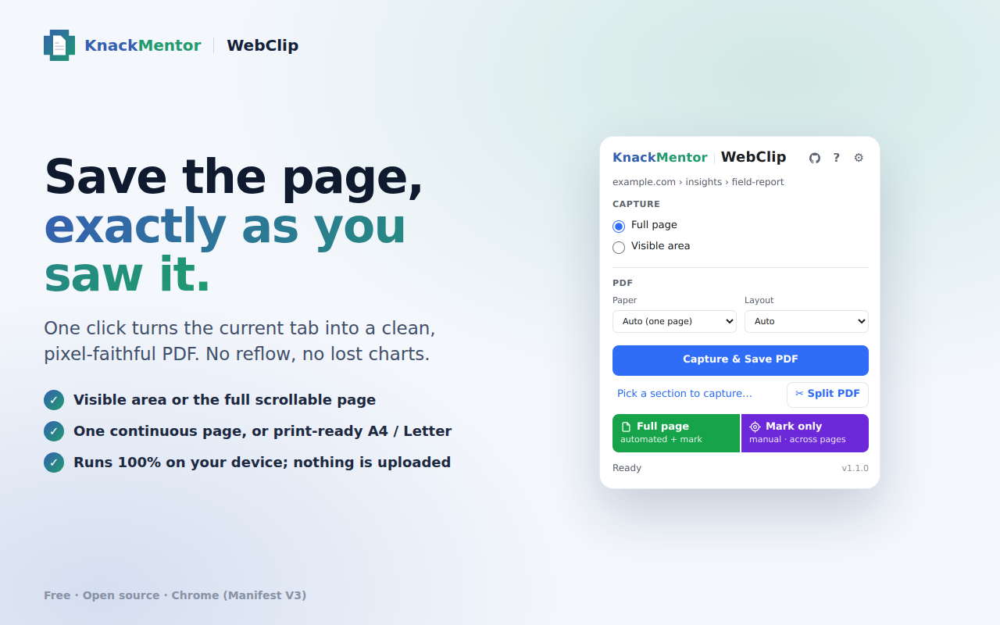
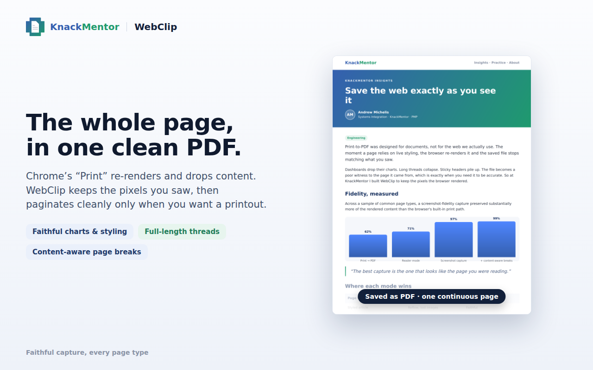
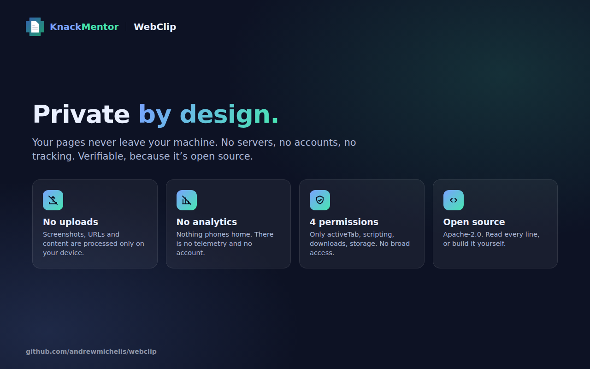

<p align="center">
  
</p>

<h1 align="center">WebClip</h1>

<p align="center">
  <strong>Save any web page exactly as you saw it.</strong>
</p>

<p align="center">
  A privacy-first Chrome extension that captures the live page to a pixel-faithful PDF.<br />
  No cloud. No account. No analytics. Nothing ever leaves your machine.
</p>

<p align="center">
  <a href="https://chromewebstore.google.com/detail/webclip/dafdhiehgfnehhbcofbepgcfcgkgdcce"></a>
  <a href="LICENSE"></a>
  
  
  
</p>

<p align="center">
  <strong><a href="https://chromewebstore.google.com/detail/webclip/dafdhiehgfnehhbcofbepgcfcgkgdcce">Install from the Chrome Web Store →</a></strong>
</p>

<p align="center">
  <a href="https://knackmentor.com/webclip/">Home &amp; try it → knackmentor.com/webclip</a>
</p>

<p align="center">
  
</p>

---

## Why WebClip

You press **Print → Save as PDF**, and the page comes out wrong. The layout reflows, a chart disappears, a web app renders half-empty, the colours shift. That happens because the browser re-renders the page through its *print* stylesheet, which was never meant to match your screen.

WebClip takes a different path. It captures the pixels the browser actually rendered, so the file you save looks like the page you were reading. A dashboard, a long chat thread, a styled article, a receipt: it comes out the way you saw it.

<p align="center">
  
  <br /><sub><em>The KnackMentor article <a href="https://knackmentor.com/blog/save-the-web-exactly-as-you-see-it.html">Save the web exactly as you see it</a>, saved with WebClip: charts, layout and typography preserved.</em></sub>
</p>

## What you can do

- **Capture the visible area, or the entire scrollable page.** WebClip scrolls and stitches long pages seamlessly, including inner panels in web apps like chat feeds, mail, and docs, and lessons that render inside a same-origin iframe (SCORM / Articulate course players).
- **Choose your output.** *Auto* gives you one continuous page that reads like the screen. *A4* or *Letter* gives you print-ready pages with **content-aware breaks** that split at the whitespace between paragraphs and never cut through a line, a table row, or a coloured bubble.
- **Keep your links.** Real links on the page (http, mailto, tel) travel into the PDF as genuine clickable annotations.
- **Re-paginate later.** Turn a saved *Auto* capture into printable A4 or Letter pages after the fact, as a clean PDF-to-PDF split.
- **Mark exactly what you want.** Beyond one section, arm Mark mode and click the parts you care about across a long page, expanding accordions or switching tabs as you go. WebClip assembles the marked pieces into one clean PDF in the order you picked. Capture the whole page *plus* your marks, or only the marks. A bundled offline Help page walks through the marking flow with worked examples.
- **Capture just one section** with the section picker, and add an optional header/footer stamp (title, URL, capture time, page number).
- **Evidence Mode** records the URL, title, capture time, and a detached SHA-256 checksum alongside the file. The semantics stay honest: it is a local clock and a local hash, never dressed up as a trusted timestamp.
- **Declutter for capture.** Ads, cookie bars, and sticky widgets are suppressed in the captured output using page heuristics, with no network filtering and no broad permissions.

Your scroll position and the page itself are always restored after a capture, whether it succeeds, fails, or you cancel.

## Private by design

This is the part that matters most, so it is worth being precise.

- **Everything runs on your device.** Screenshots, URLs, page content, and metadata are processed locally and never uploaded.
- **No analytics, no telemetry, no accounts.** There is nothing to sign into and nothing phoning home.
- **The smallest useful permission set.** The shipped extension requests only these, and deliberately does **not** request `<all_urls>` or `debugger`:

  | Permission | Why it is needed |
  |---|---|
  | `activeTab` | Read the current tab **only when you click** WebClip. Access is granted by that click and released after. |
  | `scripting` | Inject the capture logic into the page you are capturing. |
  | `downloads` | Save the finished PDF to your Downloads folder. |
  | `storage` | Remember your preferences (paper size, layout) between sessions. |

- **Open source, so you can check.** Everything above is verifiable in this repository. Read the code, read the [security policy & threat model](SECURITY.md), or build it yourself. See [PRIVACY.md](PRIVACY.md) for the full statement.

<p align="center">
  
</p>

## Install

> **Install:** WebClip is on the **[Chrome Web Store](https://chromewebstore.google.com/detail/webclip/dafdhiehgfnehhbcofbepgcfcgkgdcce)** — one click, no build needed. Prefer to build it yourself? Run it from source in under a minute:

```bash
git clone https://github.com/andrewmichelis/webclip.git
cd webclip
npm install
npm run build        # builds the unpacked extension into dist/
```

Then open `chrome://extensions`, turn on **Developer mode**, choose **Load unpacked**, and select the `dist/` folder. Pin WebClip to your toolbar and you are ready to capture.

## How it works

WebClip is a Manifest V3 extension with a shared capture core and pluggable output engines. The core resolves the active tab, prepares and restores the page, and handles decluttering and section selection. The PDF engine composites the captured tiles and lays them out, either as one continuous page or as printable pages with content-aware breaks. It is a screenshot pipeline, faithful to the rendered page, not a print-to-PDF re-render.

Quality is verified, not asserted: **76 unit tests** plus a **headless browser harness** that drives a real capture end to end and checks the output PDF (page geometry, break placement, and that every link is both injection-safe and actually clickable). That harness runs before any release.

For the full picture, see [ARCHITECTURE.md](ARCHITECTURE.md).

## Built to a standard

WebClip is built and maintained by **Andrew Michelis**, a PMP systems-integration practitioner, and released under his practice, **[KnackMentor](https://knackmentor.com)**. It is meant to reflect how every KnackMentor engagement is run: privacy respected by default, claims kept honest, and the work verified before it ships. If WebClip earns a place in your workflow, that is the standard you can expect from the practice behind it.

Found it useful? A star on this repo genuinely helps, and feedback is always welcome via [Issues](https://github.com/andrewmichelis/webclip/issues).

## Roadmap

| Stage | Scope |
|---|---|
| **v1.0** ✅ | Engine A: visible and full-page capture, one-page and printable multi-page PDF, page restoration, clickable links, section picker, Evidence Mode. |
| **v1.1** ✅ *(this release)* | Mark-and-assemble capture (mark sections, tabs, and accordions across a page and splice them in place, in order); full capture of lessons inside same-origin iframes (SCORM / Articulate players) with collapsed sections expanded; bundled offline Help; and substantially more faithful long-page stitching. |
| **v1.x** *(next)* | Engine B: extract the main content to clean Markdown, pull images through as real files, and hand off to [markdown-desk](https://github.com/andrewmichelis/markdown-desk). |
| **v2** | Advanced capture engine (Chrome DevTools Protocol), optional trusted timestamping, MHTML archival. |

## Contributing

Issues and pull requests are welcome. To work on WebClip:

```bash
npm run typecheck    # TypeScript, strict
npm test             # unit tests (Vitest)
npm run build        # bundle into dist/
```

Please keep changes covered by tests, and preserve the permission set above (it is a hard constraint, not a preference).

## Related tools

Part of a small suite of open tools by [Andrew Michelis](https://knackmentor.com). See them all at **[knackmentor.com/work](https://knackmentor.com/work/)**.

- **[av-integrity](https://github.com/andrewmichelis/av-integrity)**: detect when a vehicle's sensors are lying (an open AV sensor-fusion and integrity monitor).
- **[Markdown Desk](https://github.com/andrewmichelis/markdown-desk)**: a single-file browser app for reading and working with Markdown.
- **[HashTag Language](https://github.com/andrewmichelis/hashtag-lang)**: a small notation for facts, queries, and provenance (the shared substrate these tools speak).

<sub>Built in the open, verified before shipping. The standard behind [KnackMentor](https://knackmentor.com).</sub>

## Verifying a release

Every release is tagged and signed under the author's key, and the full source is public here, so you can build from source and compare. Authorship and first-conception are independently timestamped (RFC-3161 / OpenTimestamps) as part of the author's provenance process. Release-artifact attestation via [Sigstore](https://www.sigstore.dev/) is planned. Any certification or curation offered on top stays opt-in, self-hosting is always allowed, and there is no certificate authority you are required to trust.

## License

Apache License 2.0. Copyright 2026 Andrew P. Michelis (KnackMentor). See [LICENSE](LICENSE).
